# Fluxos de cada task (ferramenta) do MCP Runrunit

Este documento descreve o **fluxo de uso** de cada ferramenta (`runrunit_*`) exposta pelo MCP Runrunit: quando usar, entradas, saídas e sequência em relação a outras ferramentas.

---

## 1. Listagem e descoberta

### 1.1 `runrunit_list_task_filters`

**Objetivo:** Obter os filtros de tarefas disponíveis (ex.: "Minhas partes abertas") para usar em `runrunit_list_tasks`.

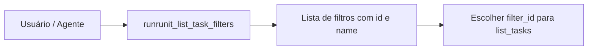

| Entrada | Saída típica |
|--------|----------------|
| Nenhuma | Array de filtros: `id`, `name`, etc. |

**Uso no fluxo:** Primeiro passo para listar "minhas tarefas" → obter `filter_id` do filtro "Minhas partes abertas".

---

### 1.2 `runrunit_list_tasks`

**Objetivo:** Listar tarefas com filtros opcionais (IDs, responsável, estágio, projeto, etc.).

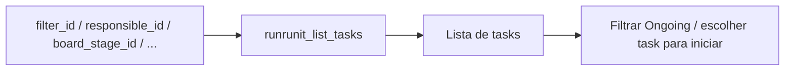

| Entrada comum | Descrição |
|---------------|-----------|
| `filter_id` | ID do filtro (ex.: Minhas partes abertas) |
| `board_stage_id` | Filtrar por coluna (Task, Ongoing, Manager Validation) |
| `responsible_id` | Tarefas onde o usuário é responsável |

**Fluxo típico:** `runrunit_list_task_filters` → obter `filter_id` → `runrunit_list_tasks(filter_id)` → inspecionar tasks e `board_stage_id`/nome do stage para detectar Ongoing.

---

### 1.3 `runrunit_get_task`

**Objetivo:** Obter detalhes de uma tarefa (incluindo `board_id`, `assignments`, etc.) para atualizar ou mover.

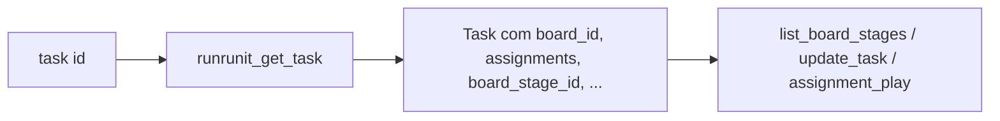

| Entrada | Saída relevante |
|--------|------------------|
| `id` (number) | `board_id`, `board_stage_id`, `assignments[]` (com `id` para play) |

**Uso no fluxo:** Antes de mover tarefa (precisa de `board_id` para `list_board_stages`); antes de dar play (precisa de `assignments[].id`).

---

### 1.4 `runrunit_list_board_stages`

**Objetivo:** Listar estágios do board (Task, Ongoing, Manager Validation) para obter `board_stage_id` usado em `runrunit_update_task`.

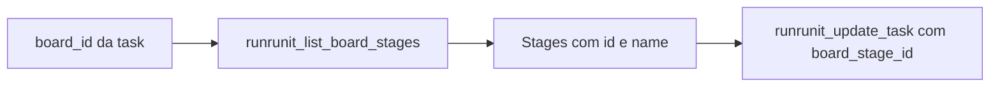

| Entrada | Saída |
|--------|--------|
| `board_id` (de `task.board_id`) | Array de stages: `id`, `name` |

**Regra:** Sempre que for mover tarefa entre colunas, obter os stages com esta ferramenta e usar o `id` do stage de destino em `runrunit_update_task`.

---

## 2. CRUD de tarefas

### 2.1 `runrunit_create_task`

**Objetivo:** Criar uma nova tarefa no Runrun.it.

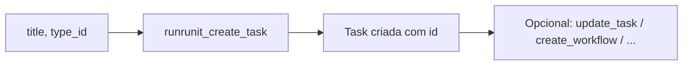

| Entrada obrigatória | Entrada opcional |
|---------------------|------------------|
| `title`, `type_id` | `project_id`, `assignments`, `desired_date`, `tag_list`, etc. |

---

### 2.2 `runrunit_update_task`

**Objetivo:** Atualizar campos de uma tarefa; o uso principal no fluxo é **mover entre colunas** com `board_stage_id`.

```mermaid
flowchart LR
  A[task id + task { board_stage_id }] --> B[runrunit_update_task]
  B --> C[Task atualizada]
  C --> D[Task na nova coluna]
```

| Entrada | Uso |
|--------|-----|
| `id`, `task: { board_stage_id }` | Mover para Task, Ongoing ou Manager Validation |
| `id`, `task: { title, desired_date, ... }` | Editar outros campos |

**Obter `board_stage_id`:** `runrunit_get_task` → `board_id` → `runrunit_list_board_stages(board_id)` → escolher `id` pelo `name` (Task, Ongoing, Manager Validation).

---

### 2.3 `runrunit_delete_task`

**Objetivo:** Excluir uma tarefa.

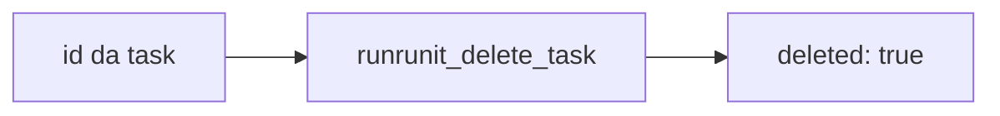

---

### 2.4 `runrunit_list_subtasks`

**Objetivo:** Listar subtarefas de uma tarefa.

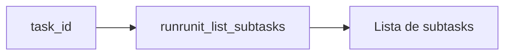

---

## 3. Workflow e tracking

### 3.1 `runrunit_create_workflow`

**Objetivo:** Criar workflow na tarefa para permitir tracking (cronômetro). Obrigatório antes de `runrunit_assignment_play` se a tarefa ainda não tiver workflow.

**Ordem obrigatória:** Antes de chamar `runrunit_create_workflow`, executar o **reajuste (mover tarefas entre colunas)**. Só depois prosseguir com o fluxo do create workflow.

#### Passo 1 — Reajuste: mover tarefa em Ongoing

1. **Listar tarefas em Ongoing do usuário:** usar `runrunit_list_task_filters` (obter filtro "Minhas partes abertas") → `runrunit_list_tasks` com `filter_id` e/ou `assignee_id` do usuário; filtrar no resultado as tasks em que o stage é **Ongoing** (por `board_stage_id` ou `board_stage_name`).
2. **Se existir tarefa em Ongoing:** perguntar ao usuário: *"A tarefa [nome] que está em Ongoing será movida para Task ou para Manager Validation?"*
3. **Se o usuário disser Manager Validation:**
   - Verificar se o campo personalizado **"Link da branch ou GTM"** está preenchido na tarefa (ex.: em `task.custom_fields` ou equivalente na API).
   - Se **não** estiver preenchido: solicitar o link ao usuário e atualizar a tarefa com `runrunit_update_task` passando o valor nesse campo personalizado (consultar `custom_field_link_branch` ou nome/ID do campo no projeto).
   - Em seguida obter `board_stage_id` de "Manager Validation" via `runrunit_get_task` → `runrunit_list_board_stages(board_id)` e mover com `runrunit_update_task` e `task: { board_stage_id }`.
4. **Se o usuário disser Task:** obter `board_stage_id` de "Task", depois mover com `runrunit_update_task` e `task: { board_stage_id }`. Não é necessário "Link da branch".
5. **Se não existir tarefa em Ongoing:** pular direto para o Passo 2.

#### Passo 2 — Fluxo do create workflow

Após o reajuste (ou se não havia Ongoing), prosseguir com o fluxo inicial **nesta ordem**:

1. **PRIMEIRO:** Mover a nova tarefa para Ongoing (`runrunit_get_task` → `runrunit_list_board_stages` → `runrunit_update_task` com `board_stage_id` = Ongoing).
2. **DEPOIS:** `runrunit_create_workflow(task_id)` → `runrunit_assignment_play` (tracking).

**NUNCA** fazer só tracking sem mover a tarefa para Ongoing antes.

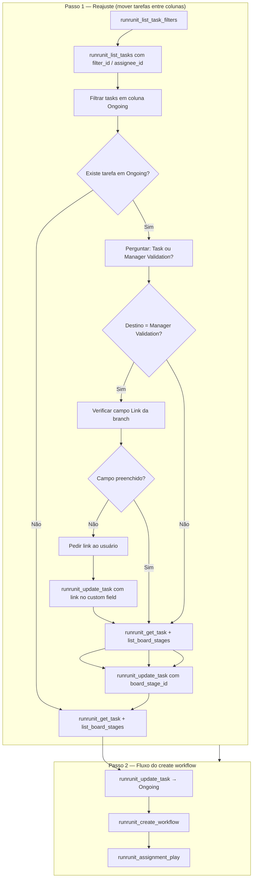

| Entrada | Condição |
|--------|----------|
| `task_id` | Tarefa não fechada, não ongoing, sem workflow já existente |

**Resumo:** Primeiro reajustar a eventual tarefa em Ongoing (listar por assignee na coluna Ongoing → perguntar destino → se Manager Validation, validar/preencher "Link da branch" → mover). Depois executar `create_workflow` e o restante do fluxo de iniciar demanda.

---

### 3.2 `runrunit_assignment_play`

**Objetivo:** Iniciar o cronômetro de trabalho (tracking) na tarefa para um assignment.

```mermaid
flowchart LR
  A[runrunit_get_task] --> B[assignments[].id]
  B --> C[runrunit_assignment_play task_id, assignment_id]
  C --> D[Tracking rodando]
```

| Entrada | Origem |
|--------|--------|
| `task_id` | ID da tarefa a iniciar |
| `assignment_id` | `task.assignments[].id` (do usuário responsável) |

**Regra:** Se o usuário já estiver com outra tarefa em play, a API pode pausar a atual e iniciar a nova.

---

## 4. Comentários

### 4.1 `runrunit_list_task_comments`

**Objetivo:** Listar comentários de uma tarefa.

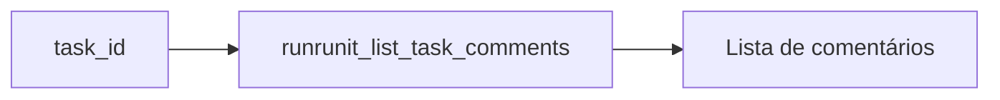

---

### 4.2 `runrunit_get_comment`

**Objetivo:** Obter um comentário por ID.

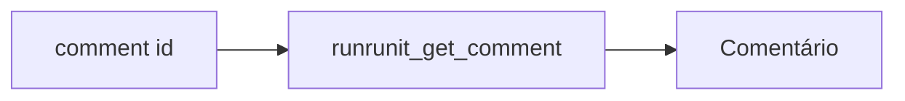

---

### 4.3 `runrunit_create_comment`

**Objetivo:** Criar comentário em uma tarefa.

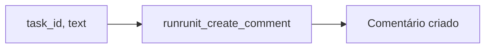

---

### 4.4 `runrunit_update_comment` / `runrunit_delete_comment`

**Objetivo:** Editar ou excluir comentário (por `id`).

---

### 4.5 `runrunit_comment_reaction`

**Objetivo:** Adicionar reação (emoji) a um comentário.

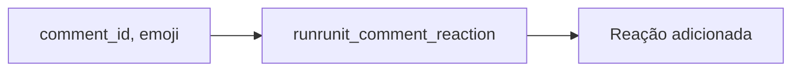

---

## 5. Sugestão de desenvolvedores

### 5.1 `runrunit_suggest_devs_with_free_queue`

**Objetivo:** Sugerir desenvolvedores com fila mais livre (menos carga na coluna Task), com filtros opcionais.

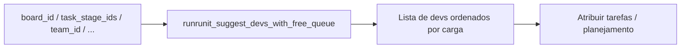

| Entrada opcional | Descrição |
|------------------|-----------|
| `board_id` | Board onde está a coluna Task |
| `task_stage_ids` | IDs dos estágios "Task" |
| `team_id`, `tribe_id`, `squad_id` | Filtrar por time/tribo/squad |
| `limit` | Máximo de devs sugeridos (1–10) |
| `include_zero_tasks` | Incluir devs sem tarefas na coluna Task |

---

## 6. Fluxos compostos (uso das tasks em sequência)

### 6.0 Fluxo: Iniciar Task ID (via Chat) — ORDEM OBRIGATÓRIA

Quando o usuário pedir **"iniciar task [ID]"** no chat, a sequência é **sempre**:

1. **TIRAR** a outra task que está em Ongoing (reajuste) — `runrunit_list_task_filters` → `runrunit_list_tasks` → filtrar Ongoing → perguntar destino (Task ou Manager Validation) → `runrunit_update_task` para mover.
2. **MOVER** a task com o ID solicitado para Ongoing — `runrunit_get_task` → `runrunit_list_board_stages` → `runrunit_update_task` com `board_stage_id` = Ongoing.
3. **INICIAR** o tracking — `runrunit_create_workflow` (se necessário) → `runrunit_assignment_play`.

**PROIBIDO:** Dar só `runrunit_assignment_play` e ignorar os passos 1 e 2. O fluxo está **errado** se fizer apenas tracking.

---

### 6.1 Fluxo: Iniciar demanda (resumo)

Ordem das ferramentas quando o usuário pede "iniciar task" (detalhes em `rules/runrunit-workflow.mdc`):

```mermaid
flowchart TD
  subgraph Reajuste ["0. Reajuste (se já existe Ongoing)"]
    F1[runrunit_list_task_filters]
    F2[runrunit_list_tasks com filter_id]
    F3[runrunit_get_task da Ongoing]
    F4[runrunit_list_board_stages]
    F5[runrunit_update_task → Task ou Manager Validation]
    F1 --> F2 --> F3 --> F4 --> F5
  end

  subgraph Git ["1. Git"]
    G1[git checkout main]
    G2[git pull]
    G3[git checkout -b task-{id}]
    G1 --> G2 --> G3
  end

  subgraph Runrunit ["2. Runrunit"]
    R1[runrunit_get_task]
    R2[runrunit_list_board_stages]
    R3[runrunit_update_task → Ongoing]
    R4[runrunit_create_workflow]
    R5[runrunit_assignment_play]
    R1 --> R2 --> R3 --> R4 --> R5
  end

  Reajuste --> Git --> Runrunit
```

| Etapa | Ferramentas MCP (em ordem) |
|-------|----------------------------|
| 0 | `runrunit_list_task_filters` → `runrunit_list_tasks` → `runrunit_get_task` (Ongoing) → `runrunit_list_board_stages` → `runrunit_update_task` (tirar a outra de Ongoing) |
| 1 | Git (checkout, pull, branch) |
| 2a | **PRIMEIRO:** `runrunit_get_task` → `runrunit_list_board_stages` → `runrunit_update_task` (mover a task solicitada para Ongoing) |
| 2b | **DEPOIS:** `runrunit_create_workflow` → `runrunit_assignment_play` (tracking) |

**CRÍTICO:** A ordem é sempre: (1) tirar a outra de Ongoing → (2) mover a nova para Ongoing → (3) tracking. **NUNCA** fazer só tracking.

---

### 6.2 Fluxo: Mover tarefa entre colunas

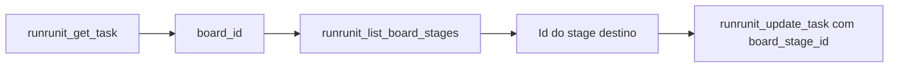

---

### 6.3 Fluxo: Listar “minhas tarefas” e detectar Ongoing

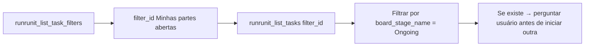

---

## Referências

- **Regra do fluxo completo:** `rules/runrunit-workflow.mdc`
- **Configuração de IDs (board, filtro, custom field):** `docs/Workflow-Config-Exemplo.md`
- **Definição das ferramentas:** `mcp-runrunit/src/adapters/driving/app.ts`
- **Implementação (tasks, comments, dev suggestions):** `mcp-runrunit/src/application/`
