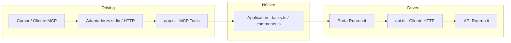

# MCP Runrun.it

Servidor MCP (Model Context Protocol) para comunicação com a API do [Runrun.it](https://runrun.it). Expõe ferramentas de **Tasks** e **Comments** para uso no Cursor ou em outros clientes MCP.

## Como o MCP fica disponível para outras pessoas?

- **Não existe um servidor MCP central** que hospeda seu código. O MCP é um **processo que roda na máquina de quem usa** (ou em um servidor que a pessoa/empresa controla).
- **Quem usa precisa:**
  1. Ter o código deste servidor (clonar o repositório do plugin ou, no futuro, instalar um pacote npm).
  2. Rodar em **Node.js**: `npm install` + `npm run build` na pasta `mcp-runrunit`.
  3. Configurar o **Cursor** (ou outro cliente MCP) para **iniciar esse processo** e passar as variáveis de ambiente (credenciais Runrun.it).
- O Cursor então **abre o processo** (`node .../dist/index.js`) e se comunica com ele por **stdio** (entrada/saída padrão). Ou seja: o “servidor” MCP é só um script Node.js que o Cursor executa e com o qual troca mensagens JSON-RPC.

**Resumo:** O plugin do Cursor (regras, skills, agentes) pode ser publicado no marketplace. O **MCP Runrun.it** é distribuído junto com o repositório (ou via npm); cada pessoa instala, compila e configura no próprio Cursor com as credenciais dela. Não há um “servidor em nuvem” do MCP — ele roda em Node.js onde o usuário quiser (local ou servidor próprio).

## Arquitetura

O projeto adota o padrão **Arquitetura Hexagonal** (Ports & Adapters): o núcleo da aplicação fica isolado de detalhes de transporte (stdio, HTTP) e do cliente HTTP do Runrun.it. As **portas** definem contratos de entrada (MCP) e saída (acesso à API); os **adaptadores** implementam esses contratos (transporte e cliente HTTP).

### Mapeamento no projeto

- **Núcleo / aplicação:** regras e orquestração dos casos de uso (Tasks e Comments). Arquivos: `src/application/tasks.ts`, `src/application/comments.ts`; em uma evolução podem depender apenas de uma abstração de "cliente Runrun.it" (porta de saída).
- **Porta de entrada (driving):** protocolo MCP (ListTools, CallTool). Implementada em `src/adapters/driving/app.ts` (registro de tools e handler que delega para a aplicação).
- **Adaptadores de entrada:** como o MCP é acessado — `src/index.ts` (stdio) e `src/server.ts` (HTTP). Ambos usam o mesmo `createMcpServer()`.
- **Porta de saída (driven):** contrato para acessar o Runrun.it (listar/criar tarefas, comentários, etc.). Hoje usada implicitamente; em uma evolução pode ser uma interface TypeScript injetada.
- **Adaptador de saída:** implementação HTTP da API Runrun.it em `src/adapters/driven/api.ts` (auth, `runrunitFetch`, tratamento de erros).

### Fluxo



### Estrutura de pastas

| Pasta / Arquivos | Papel |
|------------------|--------|
| `src/index.ts`, `src/server.ts` | Pontos de entrada (adaptadores de transporte stdio e HTTP) |
| `src/domain/` | Domínio (tipos e portas para evolução futura) |
| `src/application/` | Núcleo de aplicação: `tasks.ts`, `comments.ts` (casos de uso) |
| `src/adapters/driving/` | Adaptador de entrada: `app.ts` (MCP — definição de tools e handler CallTool) |
| `src/adapters/driven/` | Adaptador de saída: `api.ts` (cliente HTTP Runrun.it) |

A separação permite trocar o transporte (stdio vs HTTP) sem alterar o núcleo e, no futuro, mockar ou trocar a implementação da API Runrun.it para testes ou outros backends.

## Autenticação

A API do Runrun.it exige dois headers em toda requisição:

- **App-Key**: identifica a conta (obtido em Integração e Apps → API e Webhooks)
- **User-Token**: token do usuário em nome do qual as ações são executadas

Configure as variáveis de ambiente (ou no JSON de configuração do MCP no Cursor):

- `RUNRUNIT_APP_KEY` — chave da aplicação
- `RUNRUNIT_USER_TOKEN` — token do usuário

**Cloudinary** (opcional, para as skills de evidências e upload de imagens):

- `CLOUDINARY_CLOUD_NAME` — nome da cloud no Cloudinary
- `CLOUDINARY_API_KEY` — API key
- `CLOUDINARY_API_SECRET` — API secret (nunca expor no client-side)

## Por que dava erro no pacote npm e funcionava só localmente?

- **Quando você usa `npx mcp-runrunit`**, o npm instala o pacote em uma pasta (ex.: `node_modules/mcp-runrunit/`) e instala as dependências dentro dela (ex.: `node_modules/mcp-runrunit/node_modules/@modelcontextprotocol/sdk/`). O binário que o Cursor executa é `dist/index.js` desse pacote instalado.
- **Se esse `dist/index.js` for o arquivo gerado só pelo TypeScript** (`tsc`), ele contém algo como `import ... from "@modelcontextprotocol/sdk/server/stdio.js"`. O Node então tenta resolver esse módulo dentro da pasta instalada. Em muitos ambientes (Windows, cache do npx, resolução ESM) essa resolução falha com `ERR_MODULE_NOT_FOUND`, mesmo com o SDK instalado ao lado — por isso o erro aparece “num pacote que está dentro do MCP”.
- **Localmente funcionava** porque:
  1. **Modo HTTP:** você rodava `npm run start` (servidor na porta 3000). O `server.ts` usa `require(caminho_absoluto)` para o SDK, sem depender da resolução ESM do Node, então não quebra.
  2. **Modo stdio no repo:** depois de `npm run build`, o seu `dist/index.js` local é **substituído pelo bundle** (script `scripts/bundle.mjs`), que junta todo o código e o SDK em um único arquivo. Esse arquivo não importa mais nada do `@modelcontextprotocol/sdk`, então roda em qualquer lugar.
- **Para o pacote publicado funcionar via npx**, o `dist/index.js` que vai no tarball do npm **tem que ser esse bundle**, não o output do `tsc`. Por isso o build exclui `src/index.ts` do `tsc` e gera `dist/index.js` só com o script de bundle. Ao publicar, use `npm run build` (ou deixe `prepublishOnly` rodar) e depois `npm publish`; assim quem usar `npx mcp-runrunit` recebe o binário já bundled e o erro deixa de ocorrer.

## Instalação

```bash
cd mcp-runrunit
npm install
npm run build
```

## Uso no Cursor

1. Abra as configurações do Cursor (MCP).
2. Adicione o servidor no arquivo de configuração de MCP (por exemplo em `.cursor/mcp.json` ou nas configurações do Cursor).

Exemplo de configuração (ajuste o caminho para o seu projeto):

```json
{
  "mcpServers": {
    "runrunit": {
      "command": "node",
      "args": ["caminho-do-repositório-local/mcp-runrunit/dist/index.js"],
      "env": {
        "RUNRUNIT_APP_KEY": "sua_app_key",
        "RUNRUNIT_USER_TOKEN": "seu_user_token",
        "CLOUDINARY_CLOUD_NAME": "sua_cloud",
        "CLOUDINARY_API_KEY": "sua_api_key",
        "CLOUDINARY_API_SECRET": "seu_api_secret"
      }
    }
  }
}
```

Use o caminho absoluto para `dist/index.js` no seu ambiente.

### Uso via npm (para outras pessoas)

Depois de publicado no npm, qualquer pessoa pode usar com `npx` sem clonar o repositório:

```json
{
  "mcpServers": {
    "runrunit": {
      "command": "npx",
      "args": ["-y", "mcp-runrunit"],
      "env": {
        "RUNRUNIT_APP_KEY": "sua_app_key",
        "RUNRUNIT_USER_TOKEN": "seu_user_token",
        "CLOUDINARY_CLOUD_NAME": "sua_cloud",
        "CLOUDINARY_API_KEY": "sua_api_key",
        "CLOUDINARY_API_SECRET": "seu_api_secret"
      }
    }
  }
}
```

## Cursor Skills (evidências, PR, comentários na task)

O pacote inclui a pasta `cursor-skills/` com skills para uso no Cursor: **registrar-evidencias**, **upload-image-cloudinary**, **create-pr-github**, **comentar-task-runrunit**, **code-reviewer**. Para o Cursor descobri-las, copie (ou crie link) das pastas em `node_modules/mcp-runrunit/cursor-skills/` para um destes diretórios:

- **Global:** `~/.cursor/skills/` (ex.: `~/.cursor/skills/registrar-evidencias`, etc.)
- **Por projeto:** `.cursor/skills/` ou `.agents/skills/` na raiz do projeto

As skills que fazem upload de imagens (evidências em PRs e comentários Runrun.it) usam **Cloudinary**; configure `CLOUDINARY_CLOUD_NAME`, `CLOUDINARY_API_KEY` e `CLOUDINARY_API_SECRET` no `env` do MCP ou no ambiente.

## Publicar como pacote npm e no MCP Registry

Para que outras pessoas possam instalar o servidor via `npx mcp-runrunit` e listá-lo no [MCP Registry](https://registry.modelcontextprotocol.io):

1. **Substitua placeholders**  
   Em `package.json` e `server.json`, troque `YOUR_GITHUB_USERNAME` pelo seu usuário do GitHub (obrigatório para autenticação no Registry).

2. **Publicar no npm**
   ```bash
   npm login
   npm run build
   npm publish --access public
   ```
   (Se usar pacote escopo, ex.: `@seu-usuario/mcp-runrunit`, use `npm publish --access public`.)

3. **Instalar o mcp-publisher**  
   [Download](https://github.com/modelcontextprotocol/registry/releases) do binário ou:
   ```powershell
   # Windows (PowerShell)
   $arch = if ([System.Runtime.InteropServices.RuntimeInformation]::ProcessArchitecture -eq "Arm64") { "arm64" } else { "amd64" }
   Invoke-WebRequest -Uri "https://github.com/modelcontextprotocol/registry/releases/latest/download/mcp-publisher_windows_$arch.tar.gz" -OutFile "mcp-publisher.tar.gz"
   tar xf mcp-publisher.tar.gz mcp-publisher.exe
   ```
   Coloque `mcp-publisher.exe` em um diretório do PATH.

4. **Autenticar no MCP Registry**
   ```bash
   mcp-publisher login github
   ```
   Siga o fluxo no navegador (código de dispositivo).

5. **Publicar no MCP Registry**  
   Aguarde ~10–15 minutos após o `npm publish` (propagação do CDN). Depois:
   ```bash
   mcp-publisher publish
   ```
   O `server.json` na raiz do projeto será enviado; o `name` em `server.json` deve ser igual ao `mcpName` em `package.json`.

6. **Verificar**
   ```bash
   curl "https://registry.modelcontextprotocol.io/v0.1/servers?search=runrunit"
   ```

Ao atualizar a versão, altere `version` em `package.json` e em `server.json` (e em `packages[0].version` no `server.json`), faça `npm publish` e, após a espera, `mcp-publisher publish`.

### Como outra pessoa usa (resumo)

1. Clonar o repositório (ou baixar a pasta `mcp-runrunit`).
2. Na pasta: `npm install` e `npm run build`.
3. Crie um `.env` com as variáveis (use `.env.example` como referência): `RUNRUNIT_APP_KEY`, `RUNRUNIT_USER_TOKEN` e, se for usar evidências/Cloudinary, `CLOUDINARY_CLOUD_NAME`, `CLOUDINARY_API_KEY`, `CLOUDINARY_API_SECRET`.
4. No Cursor: adicionar este MCP na configuração com `RUNRUNIT_APP_KEY` e `RUNRUNIT_USER_TOKEN` (e opcionalmente as variáveis Cloudinary). Exemplo para servidor HTTP local:
   ```json
   "runrunit": {
     "url": "http://127.0.0.1:3000/mcp",
     "env": {
       "RUNRUNIT_APP_KEY": "APP_KEY",
       "RUNRUNIT_USER_TOKEN": "USER_TOKEN",
       "CLOUDINARY_CLOUD_NAME": "sua_cloud",
       "CLOUDINARY_API_KEY": "sua_api_key",
       "CLOUDINARY_API_SECRET": "seu_api_secret"
     }
   }
   ```
5. Rode `cd mcp-runrunit && npm run start`
6. Servidor iniciado, confira na janela de MCPs se o mesmo aparece ativo.

## Ferramentas (Tools)

### Tasks

| Ferramenta | Descrição |
|------------|-----------|
| `runrunit_list_tasks` | Lista tarefas com filtros opcionais (ids, responsible_id, assignee_id, filter_id, board_stage_id, project_id, etc.) |
| `runrunit_list_task_filters` | Lista filtros de tarefas (para obter filter_id de "Minhas partes abertas") |
| `runrunit_list_board_stages` | Lista stages do board (Task, Ongoing, Manager Validation) — use com runrunit_move_task_stage ao mover por nome |
| `runrunit_move_task_stage` | Move uma tarefa para uma etapa/coluna do board (task_id + board_stage_id ou board_stage_name). Para etapas que exigem "Link da branch", preencher antes com runrunit_update_task |
| `runrunit_get_task` | Retorna uma tarefa pelo ID |
| `runrunit_list_subtasks` | Lista subtarefas de uma tarefa |
| `runrunit_create_task` | Cria tarefa (obrigatório: title, type_id; opcional: project_id, assignments, desired_date, etc.) |
| `runrunit_update_task` | Atualiza tarefa (id + objeto com campos a atualizar, ex.: title, desired_date, link_da_branch). Para mover entre colunas use runrunit_move_task_stage |
| `runrunit_delete_task` | Remove uma tarefa |
| `runrunit_create_workflow` | Cria workflow para uma tarefa (permite iniciar tracking) |
| `runrunit_assignment_play` | Inicia tracking (play) em um assignment de tarefa |

### Comments

| Ferramenta | Descrição |
|------------|-----------|
| `runrunit_list_task_comments` | Lista comentários de uma tarefa |
| `runrunit_get_comment` | Retorna um comentário pelo ID |
| `runrunit_create_comment` | Cria comentário em tarefa (task_id, text) |
| `runrunit_create_external_comment` | Cria comentário na sessão externa/guest (compartilhada com clientes; channel_name: guest) |
| `runrunit_update_comment` | Edita o texto de um comentário |
| `runrunit_delete_comment` | Remove um comentário |
| `runrunit_comment_reaction` | Adiciona reação (emoji) a um comentário |

## Contexto para o agente (uso assertivo das tools)

Para que o Cursor/IA use as tools de forma assertiva e inteligente, consulte:

- **`docs/CONTEXTO-AGENTE.md`** — quando usar cada tool, parâmetros (tipos, formatos), fluxos recomendados, erros comuns e glossário Runrun.it.

No workspace do plugin existe também a regra **Runrun.it MCP** em `.cursor/rules/runrunit-mcp.mdc`, que resume essas orientações para o agente.

## Documentação da API

Os endpoints seguem a documentação oficial do Runrun.it. No repositório do plugin, a pasta `docs/` contém os markdowns de referência (por exemplo `docs/Tasks.md` e `docs/Comments.md`). Use `docs/Indíce.md` para localizar os demais endpoints. Para configurar o fluxo de trabalho (Task, Ongoing, Manager Validation), consulte `docs/Workflow-Config-Exemplo.md`.

## Base URL da API

- `https://runrun.it/api/v1.0/`

Respostas são JSON; datas em ISO 8601. Limite de 100 requisições por minuto.
