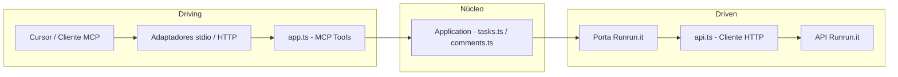

# MCP Runrun.it

Servidor MCP (Model Context Protocol) para comunicação com a API do [Runrun.it](https://runrun.it). Expõe ferramentas de **Tasks** e **Comments** para uso no Cursor ou em outros clientes MCP.

## Como o MCP fica disponível para outras pessoas?

- **Não existe um servidor MCP central** que hospeda seu código. O MCP é um **processo que roda na máquina de quem usa** (ou em um servidor que a pessoa/empresa controla).
- **Quem usa precisa:**
  1. Ter o código deste servidor (clonar o repositório do plugin ou, no futuro, instalar um pacote npm).
  2. Rodar em **Node.js**: `npm install` + `npm run build` na pasta `mcp-runrunit`.
  3. Configurar o **Cursor** (ou outro cliente MCP) para **iniciar esse processo** e passar as variáveis de ambiente (credenciais Runrun.it).
- O Cursor então **abre o processo** (`node .../dist/index.js`) e se comunica com ele por **stdio** (entrada/saída padrão). Ou seja: o “servidor” MCP é só um script Node.js que o Cursor executa e com o qual troca mensagens JSON-RPC.

**Resumo:** O plugin do Cursor (regras, skills, agentes) pode ser publicado no marketplace. O **MCP Runrun.it** é distribuído junto com o repositório (ou via npm); cada pessoa instala, compila e configura no próprio Cursor com as credenciais dela. Não há um “servidor em nuvem” do MCP — ele roda em Node.js onde o usuário quiser (local ou servidor próprio).

## Arquitetura

O projeto adota o padrão **Arquitetura Hexagonal** (Ports & Adapters): o núcleo da aplicação fica isolado de detalhes de transporte (stdio, HTTP) e do cliente HTTP do Runrun.it. As **portas** definem contratos de entrada (MCP) e saída (acesso à API); os **adaptadores** implementam esses contratos (transporte e cliente HTTP).

### Mapeamento no projeto

- **Núcleo / aplicação:** regras e orquestração dos casos de uso (Tasks e Comments). Arquivos: `src/application/tasks.ts`, `src/application/comments.ts`; em uma evolução podem depender apenas de uma abstração de "cliente Runrun.it" (porta de saída).
- **Porta de entrada (driving):** protocolo MCP (ListTools, CallTool). Implementada em `src/adapters/driving/app.ts` (registro de tools e handler que delega para a aplicação).
- **Adaptadores de entrada:** como o MCP é acessado — `src/index.ts` (stdio) e `src/server.ts` (HTTP). Ambos usam o mesmo `createMcpServer()`.
- **Porta de saída (driven):** contrato para acessar o Runrun.it (listar/criar tarefas, comentários, etc.). Hoje usada implicitamente; em uma evolução pode ser uma interface TypeScript injetada.
- **Adaptador de saída:** implementação HTTP da API Runrun.it em `src/adapters/driven/api.ts` (auth, `runrunitFetch`, tratamento de erros).

### Fluxo



### Estrutura de pastas

| Pasta / Arquivos | Papel |
|------------------|--------|
| `src/index.ts`, `src/server.ts` | Pontos de entrada (adaptadores de transporte stdio e HTTP) |
| `src/domain/` | Domínio (tipos e portas para evolução futura) |
| `src/application/` | Núcleo de aplicação: `tasks.ts`, `comments.ts` (casos de uso) |
| `src/adapters/driving/` | Adaptador de entrada: `app.ts` (MCP — definição de tools e handler CallTool) |
| `src/adapters/driven/` | Adaptador de saída: `api.ts` (cliente HTTP Runrun.it) |

A separação permite trocar o transporte (stdio vs HTTP) sem alterar o núcleo e, no futuro, mockar ou trocar a implementação da API Runrun.it para testes ou outros backends.

## Autenticação

A API do Runrun.it exige dois headers em toda requisição:

- **App-Key**: identifica a conta (obtido em Integração e Apps → API e Webhooks)
- **User-Token**: token do usuário em nome do qual as ações são executadas

Configure as variáveis de ambiente (ou no JSON de configuração do MCP no Cursor):

- `RUNRUNIT_APP_KEY` — chave da aplicação
- `RUNRUNIT_USER_TOKEN` — token do usuário

## Instalação

```bash
cd mcp-runrunit
npm install
npm run build
```

## Uso no Cursor

1. Abra as configurações do Cursor (MCP).
2. Adicione o servidor no arquivo de configuração de MCP (por exemplo em `.cursor/mcp.json` ou nas configurações do Cursor).

Exemplo de configuração (ajuste o caminho para o seu projeto):

```json
{
  "mcpServers": {
    "runrunit": {
      "command": "node",
      "args": ["caminho-do-repositório-local/mcp-runrunit/dist/index.js"],
      "env": {
        "RUNRUNIT_APP_KEY": "sua_app_key",
        "RUNRUNIT_USER_TOKEN": "seu_user_token"
      }
    }
  }
}
```

Use o caminho absoluto para `dist/index.js` no seu ambiente.

### Como outra pessoa usa (resumo)

1. Clonar o repositório (ou baixar a pasta `mcp-runrunit`).
2. Na pasta: `npm install` e `npm run build`.
3. Crie um .env com as variáveis `RUNRUNIT_APP_KEY` e `RUNRUNIT_USER_TOKEN`.
4. No Cursor: adicionar este MCP na configuração com `RUNRUNIT_APP_KEY` e `RUNRUNIT_USER_TOKEN`.
"nome-do-mcp": {
      "url": "http://127.0.0.1:3000/mcp", // vai estar rodando local.
      "env": {
        "RUNRUNIT_APP_KEY": "APP_KEY",
        "RUNRUNIT_USER_TOKEN": "USER_TOKEN"
      }
    },
5. rode o comandao `cd mcp-runrunit && npm run start`
6. Servidor iniciado, confira na janela de MCPs se o mesmo aparece ativo.

## Ferramentas (Tools)

### Tasks

| Ferramenta | Descrição |
|------------|-----------|
| `runrunit_list_tasks` | Lista tarefas com filtros opcionais (ids, project_id, is_closed, sort, page, limit, etc.) |
| `runrunit_get_task` | Retorna uma tarefa pelo ID |
| `runrunit_list_subtasks` | Lista subtarefas de uma tarefa |
| `runrunit_create_task` | Cria tarefa (obrigatório: title, type_id; opcional: project_id, assignments, desired_date, etc.) |
| `runrunit_update_task` | Atualiza tarefa (id + objeto com campos a atualizar) |
| `runrunit_delete_task` | Remove uma tarefa |

### Comments

| Ferramenta | Descrição |
|------------|-----------|
| `runrunit_list_task_comments` | Lista comentários de uma tarefa |
| `runrunit_get_comment` | Retorna um comentário pelo ID |
| `runrunit_create_comment` | Cria comentário em tarefa (task_id, text) |
| `runrunit_update_comment` | Edita o texto de um comentário |
| `runrunit_delete_comment` | Remove um comentário |
| `runrunit_comment_reaction` | Adiciona reação (emoji) a um comentário |

## Documentação da API

Os endpoints seguem a documentação oficial do Runrun.it. No repositório do plugin, a pasta `docs/` contém os markdowns de referência (por exemplo `docs/Tasks.md` e `docs/Comments.md`). Use `docs/Indíce.md` para localizar os demais endpoints.

## Base URL da API

- `https://runrun.it/api/v1.0/`

Respostas são JSON; datas em ISO 8601. Limite de 100 requisições por minuto.
