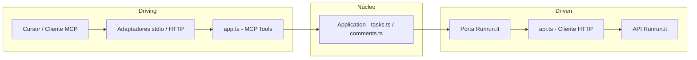

# MCP Runrun.it

Servidor MCP (Model Context Protocol) para comunicação com a API do [Runrun.it](https://runrun.it). Expõe ferramentas de **Tasks** e **Comments** para uso no Cursor ou em outros clientes MCP.

## Arquitetura

O projeto adota o padrão **Arquitetura Hexagonal** (Ports & Adapters): o núcleo da aplicação fica isolado de detalhes de transporte (stdio, HTTP) e do cliente HTTP do Runrun.it. As **portas** definem contratos de entrada (MCP) e saída (acesso à API); os **adaptadores** implementam esses contratos (transporte e cliente HTTP).

### Mapeamento no projeto

- **Núcleo / aplicação:** regras e orquestração dos casos de uso (Tasks e Comments). Arquivos: `src/application/tasks.ts`, `src/application/comments.ts`; em uma evolução podem depender apenas de uma abstração de "cliente Runrun.it" (porta de saída).
- **Porta de entrada (driving):** protocolo MCP (ListTools, CallTool). Implementada em `src/adapters/driving/app.ts` (registro de tools e handler que delega para a aplicação).
- **Adaptadores de entrada:** como o MCP é acessado — `src/index.ts` (stdio) e `src/server.ts` (HTTP). Ambos usam o mesmo `createMcpServer()`.
- **Porta de saída (driven):** contrato para acessar o Runrun.it (listar/criar tarefas, comentários, etc.). Hoje usada implicitamente; em uma evolução pode ser uma interface TypeScript injetada.
- **Adaptador de saída:** implementação HTTP da API Runrun.it em `src/adapters/driven/api.ts` (auth, `runrunitFetch`, tratamento de erros).

### Fluxo



### Estrutura de pastas

| Pasta / Arquivos | Papel |
|------------------|--------|
| `src/index.ts`, `src/server.ts` | Pontos de entrada (adaptadores de transporte stdio e HTTP) |
| `src/domain/` | Domínio (tipos e portas para evolução futura) |
| `src/application/` | Núcleo de aplicação: `tasks.ts`, `comments.ts` (casos de uso) |
| `src/adapters/driving/` | Adaptador de entrada: `app.ts` (MCP — definição de tools e handler CallTool) |
| `src/adapters/driven/` | Adaptador de saída: `api.ts` (cliente HTTP Runrun.it) |

A separação permite trocar o transporte (stdio vs HTTP) sem alterar o núcleo e, no futuro, mockar ou trocar a implementação da API Runrun.it para testes ou outros backends.

## Autenticação

A API do Runrun.it exige dois headers em toda requisição:

- **App-Key**: identifica a conta (obtido em Integração e Apps → API e Webhooks)
- **User-Token**: token do usuário em nome do qual as ações são executadas

Configure as variáveis de ambiente (ou no JSON de configuração do MCP no Cursor):

- `RUNRUNIT_APP_KEY` — chave da aplicação
- `RUNRUNIT_USER_TOKEN` — token do usuário

**Cloudinary** (opcional, para as skills de evidências e upload de imagens):

- `CLOUDINARY_CLOUD_NAME` — nome da cloud no Cloudinary
- `CLOUDINARY_API_KEY` — API key
- `CLOUDINARY_API_SECRET` — API secret (nunca expor no client-side)

## Instalação e utilização local

```bash
cd mcp-runrunit
npm install
npm run build
```

## Uso no Cursor

1. Abra as configurações do Cursor (MCP).
2. Adicione o servidor no arquivo de configuração de MCP (por exemplo em `.cursor/mcp.json` ou nas configurações do Cursor).

Exemplo de configuração (ajuste o caminho para o seu projeto):

```json
{
  "mcpServers": {
    "runrunit": {
      "command": "node",
      // Use o caminho absoluto para `dist/index.js` no seu ambiente. 
      "args": ["caminho-do-repositório-local/mcp-runrunit/dist/index.js"],
      "env": {
        "RUNRUNIT_APP_KEY": "sua_app_key",
        "RUNRUNIT_USER_TOKEN": "seu_user_token",
        "CLOUDINARY_CLOUD_NAME": "sua_cloud",
        "CLOUDINARY_API_KEY": "sua_api_key",
        "CLOUDINARY_API_SECRET": "seu_api_secret"
      }
    }
  }
}

// ou

"runrunit-mcp": {
      "url": "http://localhost:3000/mcp",
      "env": {
        // Nesse modo é importante criar o arquivo .env na raiz do mcp ./plugin-sentinel-mcp/mcp-runrunit
      }
    },
```

### Uso via npm (para outras pessoas)

Depois de publicado no npm, qualquer pessoa pode usar com `npx` sem clonar o repositório:

```json
{
  "mcpServers": {
    "runrunit": {
      "command": "npx",
      "args": ["-y", "mcp-runrunit"],
      "env": {
        "RUNRUNIT_APP_KEY": "<RUNRUNIT_APP_KEY>",
        "RUNRUNIT_USER_TOKEN": "<RUNRUNIT_USER_TOKEN>",
        "CLOUDINARY_CLOUD_NAME": "<CLOUDINARY_CLOUD_NAME>",
        "CLOUDINARY_API_KEY": "<CLOUDINARY_API_KEY>",
        "CLOUDINARY_API_SECRET": "<CLOUDINARY_API_SECRET>",
        "BOT_DISCORD_TOKEN_PUBLIC_ID": "<BOT_DISCORD_TOKEN_PUBLIC_ID>",
        "BOT_RUNRUNIT_REPORT_PRIVATE_KEY": "<BOT_RUNRUNIT_REPORT_PRIVATE_KEY>",
        "DISCORD_GUILD_ID": "<DISCORD_GUILD_ID>",
        "DISCORD_CHANNEL_ID": "<DISCORD_CHANNEL_ID>"
      }
    }
  }
}
```

## Cursor Skills (evidências, PR, comentários na task, agents)

O pacote inclui a pasta `cursor-skills/` com skills para uso no Cursor: **registrar-evidencias**, **upload-image-cloudinary**, **create-pr-github**, **comentar-task-runrunit**, **code-reviewer**. Para o Cursor descobri-las, copie (ou crie link) das pastas em `node_modules/mcp-runrunit/cursor-skills/` para um destes diretórios:

- **Global:** `~/.cursor/skills/` (ex.: `~/.cursor/skills/registrar-evidencias`, etc.)
- **Por projeto:** `.cursor/skills/` ou `.agents/skills/` na raiz do projeto

As skills que fazem upload de imagens (evidências em PRs e comentários Runrun.it) usam **Cloudinary**; configure `CLOUDINARY_CLOUD_NAME`, `CLOUDINARY_API_KEY` e `CLOUDINARY_API_SECRET` no `env` do MCP ou no ambiente.

## Ferramentas (Tools)

### Tasks

| Ferramenta | Descrição |
|------------|-----------|
| `runrunit_list_tasks` | Lista tarefas com filtros opcionais (ids, responsible_id, assignee_id, filter_id, board_stage_id, project_id, etc.) |
| `runrunit_list_task_filters` | Lista filtros de tarefas (para obter filter_id de "Minhas partes abertas") |
| `runrunit_list_board_stages` | Lista stages do board (Task, Ongoing, Manager Validation) — use com runrunit_move_task_stage ao mover por nome |
| `runrunit_move_task_stage` | Move uma tarefa para uma etapa/coluna do board (task_id + board_stage_id ou board_stage_name). Para etapas que exigem "Link da branch", preencher antes com runrunit_update_task |
| `runrunit_get_task` | Retorna uma tarefa pelo ID |
| `runrunit_list_subtasks` | Lista subtarefas de uma tarefa |
| `runrunit_create_task` | Cria tarefa (obrigatório: title, type_id; opcional: project_id, assignments, desired_date, etc.) |
| `runrunit_update_task` | Atualiza tarefa (id + objeto com campos a atualizar, ex.: title, desired_date, link_da_branch). Para mover entre colunas use runrunit_move_task_stage |
| `runrunit_delete_task` | Remove uma tarefa |
| `runrunit_create_workflow` | Cria workflow para uma tarefa (permite iniciar tracking) |
| `runrunit_assignment_play` | Inicia tracking (play) em um assignment de tarefa |

### Comments

| Ferramenta | Descrição |
|------------|-----------|
| `runrunit_list_task_comments` | Lista comentários de uma tarefa |
| `runrunit_get_comment` | Retorna um comentário pelo ID |
| `runrunit_create_comment` | Cria comentário em tarefa (task_id, text) |
| `runrunit_create_external_comment` | Cria comentário na sessão externa/guest (compartilhada com clientes; channel_name: guest) |
| `runrunit_update_comment` | Edita o texto de um comentário |
| `runrunit_delete_comment` | Remove um comentário |
| `runrunit_comment_reaction` | Adiciona reação (emoji) a um comentário |

### Discord

| Ferramenta | Descrição |
|------------|-----------|
| `runrunit_discord_send_message` | Envia mensagem em um canal do Discord (channel_id, content; opcional task_id, project_id). Requer BOT_RUNRUNIT_REPORT. |
| `runrunit_discord_create_channel` | Cria um canal de texto no servidor (guild). Parâmetros: name (slug, ex.: client-1); opcional guild_id, parent_id, topic. Usa DISCORD_GUILD_ID se guild_id não for passado. |
| `runrunit_discord_list_channels` | Lista canais do servidor Discord. guild_id opcional (usa DISCORD_GUILD_ID ou resolve por DISCORD_CHANNEL_ID). |
| `runrunit_discord_get_or_create_channel` | Obtém ou cria um canal por cliente Runrun.it (1 canal por cliente). client_id ou client_name (ex.: "Client 1" → slug client-1). Retorna channel_id e channel_name; use antes de enviar mensagens. |

### Skills

Skills em `cursor-skills/`:

| Skill | Descrição |
|-------|-----------|
| `code-reviewer` | Revisão de código alinhada aos padrões da agência. Use ao revisar PRs, sugerir melhorias ou validar implementações. |
| `registrar-evidencias` | Captura screenshots em múltiplos viewports (mobile, tablet, desktop) a partir de URLs "antes" e "depois". Usar para evidências visuais, comparar antes/depois, documentar mudanças de UI ou preparar imagens para PRs e relatórios. |
| `upload-image-cloudinary` | Upload de imagens para Cloudinary e retorno de URLs públicas. Usar quando screenshots ou evidências precisarem ser hospedadas (ex.: body da PR, docs). Requer CLOUDINARY_CLOUD_NAME, CLOUDINARY_API_KEY e CLOUDINARY_API_SECRET. |
| `comentar-task-runrunit` | Orquestra evidências e comentário na tarefa do Runrun.it: captura antes/depois, upload no Cloudinary, opcionalmente abre PR e cria comentário na task com resumo, passo a passo de teste e links; grava link_da_branch na task se houver PR. |
| `create-pr-github` | Cria um pull request bem estruturado, com descrição, rótulos, revisores e evidências visuais. Inclui preparar branch, descrição, checklist e output obrigatório (link da PR, branch, ambiente de destino). |

### Agents


| Agente | Nome exibido | Descrição | Quando usar |
|--------|--------------|-----------|-------------|
| **context-bridge** | Doc-Brief (Implementation Brief) | Filtro de documentação técnica: extrai lógica de implementação, assinaturas e dependências em Implementation Briefs de alta densidade; remove marketing e redundância. | Quando precisar transformar documentação longa em um resumo técnico pronto para implementação (Quick Start, Core Logic, API Reference, Gotchas). |
| **kieran-typescript-reviewer** | kieran-typescript-reviewer | Revisa código TypeScript com barra de qualidade alta em type safety, padrões modernos e manutenibilidade. | Após implementar features, modificar código ou criar novos componentes TypeScript; para garantir convenções e boas práticas. |
| **mentor** | Mentor mode | Ajuda a mentorar o engenheiro com orientação e suporte, sem editar código. | Quando quiser desafiar premissas, fazer perguntas socráticas e guiar a solução sem dar a resposta pronta. |
| **performance-optimizer** | performance-optimizer | Especialista em otimização de performance, profiling, Core Web Vitals e otimização de bundle. | Para melhorar velocidade, reduzir tamanho de bundle e otimizar runtime; termos: performance, optimize, speed, slow, memory, cpu, benchmark, lighthouse. |
| **prd** | Create PRD Chat Mode | Gera um PRD (Product Requirements Document) em Markdown com user stories, critérios de aceite, considerações técnicas e métricas; opcionalmente cria issues no GitHub. | Para documentar requisitos de produto de forma estruturada e, se desejado, gerar issues a partir das user stories. |
| **toph** | Toph | Especialista em acessibilidade web (WCAG 2.1/2.2), UX inclusiva e testes de a11y. | Para revisar acessibilidade, teclado, foco, ARIA, formulários, mídia, testes com leitores de tela e ferramentas (axe, pa11y, Lighthouse). |
| **security-reviewer** | security-reviewer | Revisor focado em segurança: vulnerabilidades e boas práticas. | Para checar injeção (SQL, XSS, comandos), autenticação/autorização, dados sensíveis, criptografia, dependências e validação de entrada. |


## Contexto para o agente (uso assertivo das tools)

Para que o Cursor/IA use as tools de forma assertiva e inteligente, consulte:

- **`docs/CONTEXTO-AGENTE.md`** — quando usar cada tool, parâmetros (tipos, formatos), fluxos recomendados, erros comuns e glossário Runrun.it.

No workspace do plugin existe também a regra **Runrun.it MCP** em `.cursor/rules/runrunit-mcp.mdc`, que resume essas orientações para o agente.

## Documentação da API

Os endpoints seguem a documentação oficial do Runrun.it. No repositório do plugin, a pasta `docs/` contém os markdowns de referência (por exemplo `docs/Tasks.md` e `docs/Comments.md`). Use `docs/Indíce.md` para localizar os demais endpoints. Para configurar o fluxo de trabalho (Task, Ongoing, Manager Validation), consulte `docs/Workflow-Config-Exemplo.md`.

## Base URL da API

- `https://runrun.it/api/v1.0/`

Respostas são JSON; datas em ISO 8601. Limite de 100 requisições por minuto.
